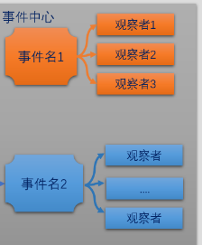
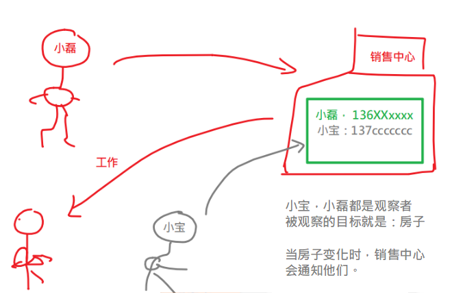

## 观察者模式

在vue中实现数据双向绑定就是使用到了**观察者模式**（23种设计模式之一）。

目标变化了，所有的观察者都去执行。

```
var vm = new Vue()
vm.$on(); // 添加观察者
vm.$emit() ; // 发布事件，让观察者们去执行
```





## 把函数放在数组中，用循环去调用执行

从语法层面，要能够理解：数组里面是可以放函数的。

```javascript
function f1() {
    console.log("f1")
}
let f2 = () => {
    console.log("f2")
}
let f3 = function (){
    console.log("f3")
}

// // 如何同时执行多个函数
// f1()
// f2()
// f3()

// 定义一个数组，然后把所有的函数都放在这个数组

var arr = []
arr.push(f1)
arr.push(f2)
arr.push(f3)
console.log(arr)
// 循环去执行
arr.forEach(item => {
    // 由于数组中放入的全是函数
    // item就是一个函数
    // console.log(item);
    item()
})
```


## 把数组设置在对象中，通过属性名来访问遍历

```javascript
// 当某个事件发生时，多个观察者被执行
			
function f1() {console.log("小磊在观察")}
let f2 = () => {console.log("小李在观察")}

let f3 = function (){console.log("小宝在观察")}
let f4 = function() { console.log("小帅在观察") }

// 一个对象 ，属性值就是数组
// 数组中添加函数
var obj = {
    "wuhan": [],
    "beijing":[]
}
obj.wuhan.push( f1 )
obj.wuhan.push( f2 )
obj.wuhan.push( f4 )

//------------------
obj.beijing.push(f3)
obj.beijing.push(f4)

// 假设现在武汉的房子涨子，要去通知所有关心武汉房子的人
obj.wuhan.forEach(item => {
    item()
})
// 假设现在北京的房子涨子，要去通知所有关心北京房子的人
console.log('假设现在北京的房子涨子，要去通知所有关心北京房子的人');
obj.beijing.forEach(item => {
    item()
})
```


事件管理中心写一个方法单独来触发事件

```javascript
<script type="text/javascript">
    // 一个对象 ，属性值就是数组
    // 数组中添加函数
    var eventCenter = {
        "wuhan": [],
        "beijing":[],
        "shanghai":[]
    }
/*
				wuhan,beijing,shanghai 都是事件名。
				eventCenter.wuhan是一个数组，用来收集  关心 wuhan 这个事件
				的观察者，它里面用来放数组
			*/

// 函数，就是观察者

function f1() {console.log("小磊在观察")}
let f2 = () => {console.log("小李在观察")}
let f3 = function (){console.log("小宝在观察")}
let f4 = function() { console.log("小帅在观察") }

// 让观察者监视特定的事件 
// f1观察者去监视wuhan这个事件。
// 就是把它加入到一个数组中
eventCenter.shanghai.push( f1 )

eventCenter.wuhan.push( f1 )
eventCenter.wuhan.push( f4 )

eventCenter.beijing.push( f4 )


// 当事件发生时，观察者要执行。
// function emit(事件名){}
function emit (eventName) {
    // 模拟这个事件发生，让所有与之对应的观察者都执行一次
    // 在这里写代码
    // 思路：根据事件名，去取出所有观察者，循环去执行
    var arr = eventCenter[eventName]
    // console.log(arr);
    // 如果取不到这个属性，说明这个事件不存在
    if(!arr) {
        return
    }
    arr.forEach(item => {
        item()
    })
}

// emit("wuhan");

// emit("shanghai")
emit("beijing11")

</script>
```

## 面向对象的写法

```javascript
function f1() {console.log("小磊在观察")}
let f2 = () => {console.log("小李在观察")}
let f3 = function (){console.log("小宝在观察")}
let f4 = function() { console.log("小帅在观察") }


// 定义一个构造器
function EventCenter () {
    // 给对象添加属性
    this.eCenter = {
        "wuhan" : []
    }
}

// 给指定的事件，添加观察者
/*
			eventName: 要监视的事件名
			callback: 观察者。当这个事件发生时，要执行的函数
		   */   
EventCenter.prototype.addListener = function(eventName,callback){
    // 给指定的事件，添加观察者
    // 1. 取出当前事件中心 中，监视这个事件的所有观察者
    var arr = this.eCenter[eventName]
    if(!arr) {
        // 说明这个事件名，在事件中心没有。
        // 添加一个属性，值就是空数组
        this.eCenter[eventName] = []
        // 再来去添加观察者
        this.eCenter[eventName].push(callback)
    } else {

        // 2. 把callback添加到这个数组中
        arr.push( callback )
    }
}
// 发布一个事件
// 当某个事件发生时，去循环调用所有的对应的观察者
EventCenter.prototype.emit = function(eventName){
    // 取出事件中心 当前事件的所有观察者，循环执行
    console.log( this.eCenter[eventName]	  ) 
    var arr = this.eCenter[eventName];
    arr.forEach(item =>{
        item()
    })
}

// 创建一个对象

// 售楼部
var ec = new EventCenter()

// 售楼部：把顾客的信息抄在本子上
// f1这个顾客想买武汉的房子
// f2这个顾客想买北京的房子
ec.addListener("wuhan", f1)
ec.addListener("beijing", f2)
ec.addListener("wuhan", f3)
ec.addListener("wuhan", f4)

// // 通知所有武汉的买家
// ec.emit("wuhan")

// 通知所有北京的买家
ec.emit("beijing")
```

