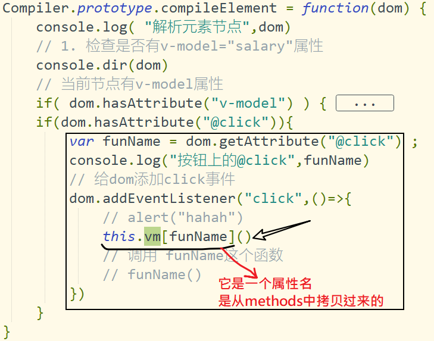

## 给表单元素添加input事件，实现从视图到数据

```javascript
// 当前节点有v-model属性
if( dom.hasAttribute("v-model") ) {
    // 取出属性值：
    // 把对象中的key属性的值，显示在当前的input框中。
    var key = dom.getAttribute("v-model");
    dom.value = this.vm[key]

    // 添加监听者
    // 当key属性发生变化时，去更新input框中的值
    ec.addListener(key,()=>{
        dom.value = this.vm[key]
    })

    // 给元素本身添加input事件
    dom.addEventListener("input",(e)=>{
        // console.dir(e)
        // 1. 获取当前用户改完之后的值
        console.log(e.target.value)
        // 2. 设置给对象的属性值（数据）
        //    会进入到set拦截器,发布消息
+        this.vm[key] = e.target.value

        console.log("用户在input中做了修改")
    })

}
```


## 实现@click功能

思路：

- 在构造器中把methods中方法拷贝一份到vm中。

- 找出有@click的元素结点
  - 给它加click事件，在click事件中执行对应的方法


快速实现属性拷贝

```javascript
function MVVM(options) {
   
    const {data,el,methods} = options

    //....

    
    // methods中的属性也给this对象来一份
    Object.assign(this, methods)
}
```




## 服务器渲染

SSR : server side render 。

渲染是：数据（json） -----> html文档（dom ）  它是发生在服务器端的。

即：从服务器获取回来的直接就是整个页面（包含数据）

好处：

- 打开快
- 有利于SEO（让百度爬虫的可以收录你的网页）。

缺点：

- 不利于前后端分离开发


## 客户端渲染

ajax请求数据，数据通过vue.js在本地渲染。

不利于SEO


## vue-ssr

vue官方提供了一个工具`vue-server-renderer`可以帮我们把vue实例转成html。

就可以直接从服务器上使用vue，转成html返回。


## nuxt.js的基本应用

- 它是一个包，要额外安装。
- 它集成了vue,vue-router,vuex,webpack,babel,vue-ssr.........................
- 它不是vue官方的产品。
- 它可以用vue开发服务器端渲染的单页应用