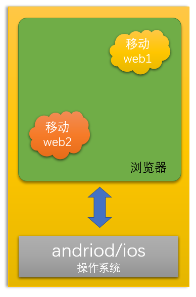
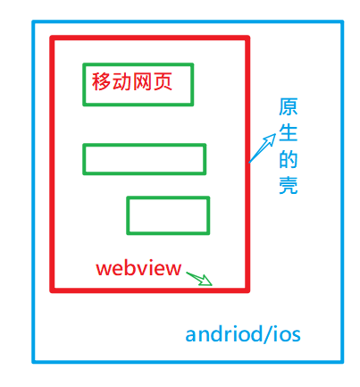
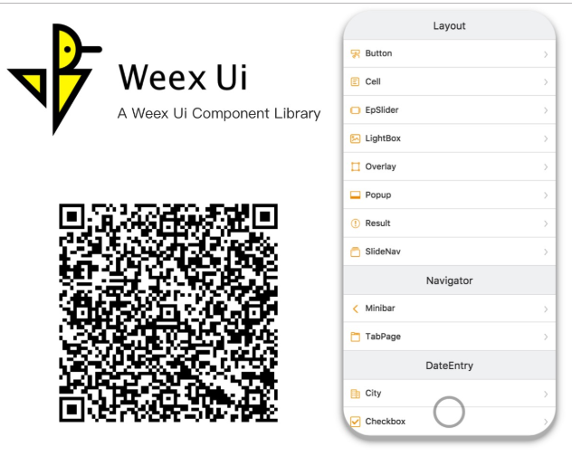

App开发的常见方式 

内容:

- 常见的app开发方式及技术栈
- 各自的优缺点

目标：

- 了解自已在大前端所处的位置
- 面对面试，工作更从容

## 问题导入

> 如果你老家有一个市值约100万的商店，主要售卖厨房的生活用品：米，油，调料，他们希望开发一个应用能够让：
>
> 1. 用户通过这个应用下单，结算
> 2. 外卖员派送上门
> 3. 分析用户购买数据，定时推送
>
> 问：
>
> 可以怎么去开发软件来满足这家商店的需求。

## App的类别

app就是可以运行在移动设备（手机，平机）上的应用。**移动**它相对于运行在台式电脑，笔记本电脑这种“固定”的设置而言。

1. **`原生App（navtive app）`**  

2. **`WebApp`** 

3. **`HybridApp`**

4. **`跨平台开发`** => React-Native => 跨平台 (  安卓/ 苹果 `/ 黑莓 /塞班 / windows phone )`

5. 其他类型(**`小程序`**/**`快应用`**等等)  微信 /支付宝 /百度/抖音/头条/qq/钉钉/高德..

   ...快应用

## NativeApp

native：原生的。它是最纯真的开发方式，可以直接运行在手机操作系统中。

原生应用程序是某一个移动平台（比如iOS或安卓）所特有的，使用相应平台支持的开发工具和语言（比如iOS平台支持Xcode和Objective-C，安卓平台支持Eclipse和Java）。原生应用程序看起来（外观）和运行起来（性能）是最佳的。

- 它针对不同的手机操作系统，开发不同的软件。历史上存在过的手机操作系统：
  - Symbian（中国大陆译名为“塞班”，其他地区则直接使用英文名称“Symbian”），一种移动操作系统，由诺基亚公司拥有，广泛使用于诺基亚手机上，2013年后停止发展。
  - [Windows Phone](https://baike.tw.wjbk.site/baike-Windows_Phone)。微软公司。
  - BlackBerry。2016年7月4日，黑莓宣布正式放弃BlackBerry 10系统
  - IOS。2007年初苹果推出iPhone，搭载iOS操作系统 
  - Android。2007年9月谷歌推出Android操作系统，并开放源代码
- 现在也就只有iOS和Android两大系统，需要各自语言开发各自App。 （需要两拨人员各做的，但是各做各的功能，其代码完全不能复用）

### 现状

iOS

- 语言：Object-C、Swift
- 开发工具：XCode
- 操作系统：macOS

Android：

- 语言：Java、Kotlin
- 开发工具：Eclipse、Android Studio
- 操作系统：Windows、macOS、Linux 都支持

### 优点

性能和体验都是最好的, 用的都是本系统的原生组件,没有网络渲染问题

### 缺点

开发和发布成本高  ，需要专业的安卓 和 ios开发人员  ios  系统 闭环 , 应用上传appStore。

缺点是开发成本高，更新麻烦，无法跨平台，Android和iOS都需要单独开发，而且开发比较复杂，所以开发成本非常高、开发周期也比较长。升级比较麻烦，每次升级都需要下载安装包，而且iOS每个版本还得经过App Store的审核，Android和iOS很难同步发布。优点是速度快，性能高，用户体验效果好。 根据硬件操作系统不同，来开发不同的程序。

## webApp开发

[M站演示](https://m.toutiao.com/?)  

**定义**: 移动端的网站，常被称为**`H5应用`**，说白了就是特定运行在移动端浏览器上的网站应用。一般泛指 **`SPA`(**Single Page Application)模式开发出的网站，与**`MPA`（**Multi-page Application）对应。 

### 优点

1. 开发成本低,可以跨平台,调试方便，开发速度最快

   webapp一般只需要一个前端人员开发出一套代码,然后即可应用于各大主流**`浏览器`**(特殊情况可以代码进行下兼容),没有新的学习成本,而且可以直接在浏览器中调试。

2. 维护成本低

   同上,如果代码合理,只需要一名前端就可以维护多个web app

3. 更新最为快速

   由于web app资源是直接部署在服务器端的,所以只需要替换服务器端的文件,用户访问是就已经更新了(当然需要解决一些缓存问题)

4. 无需安装App,不会占用手机内存

   通过浏览器即可访问,无需安装,用户就会比较愿意去用

### 缺点

1. 性能低,用户体验差

   由于是直接通过的浏览器访问,所以无法使用原生的API,操作体验不好

2. 依赖于网络,页面访问速度慢,耗费流量

   Web App每次访问都需要去服务端加载资源访问,所以必须依赖于网络,而且网速慢时访问速度很不理想,特别是在移动端,如果网站优化不好会无故消耗大量流量

3. 功能受限,大量功能无法实现

   只能使用Html5的一些特殊api,无法调用原生API,所以很多功能存在无法实现情况

4. 临时性入口,**`用户留存率低`**, 这个**`几乎是不可原谅`**的

   这既是它的优点,也是缺点,优点是无需安装,缺点是用完后有时候很难再找到,或者说很难专门为某个web app留存一个入口,导致用户很难再次使用

**应用技术**：**`ReactJS`**，**`AngularJS`**，`VueJS`等等 

## HybridApp

WebView => 原生浏览器的内置浏览器

**定义**:**混合**模式移动应用，介于**`Web App`、`Native App`**这两者之间的App开发技术，兼具“Native App良好交互体验的优势”和“Web App跨平台开发的优势” ,**原生客户端的壳`WebView`，其实里面是HTML5的网页**

>webview 就是一个内置的浏览器  => 里面是我们做的 h5的网页  外面是一个安卓或者 ios的**`壳`**  只提供 API,不做具体业务   

举例 :  电商app ,  所有的业务 都是h5网页, 外面的壳 是安卓或者ios,提供SDK(调用原生能力的包) / 拍照/录像/录音/   h5网页  => js  调用 原生能力 

- 把网页打包成移动 App
- 使你的 Web 程序可以访问手机原生能力

### 优点

1. 开发成本较低,可以跨平台,调试方便

   Hybrid模式下,由原生提供统一的API给JS调用,实际的主要逻辑有Html和JS来完成,而由于最终是放在webview中显示的,所以只需要写一套代码即可,达到跨平台效果,另外也可以直接在浏览器中调试,很为方便

   最重要的是只需要一个前端人员稍微学习下JS api的调用即可,无需两个独立的原生人员

   一般Hybrid中的跨平台最少可以跨三个平台:Android App,iOS App,普通webkit浏览器

2. 维护成本低,功能可复用

   同上,如果代码合理,只需要一名前端就可以维护多个app,而且很多功能还可以互相复用

3. 更新较为自由

    混合开发 实际上 就是 安卓的壳 /ios壳  +  html/js/css 

   更新的话 只需要 下载最新的  html+js+css(**`本地模式`**)

   安卓的壳 /ios壳  + webview(**`线上地址`**)(**`线上模式`**)  => 更新只需要部署到服务器即可 (性能和效率是比较低)

   虽然没有web app更新那么快速,但是Hybrid中也可以通过原生提供api,进行资源主动下载,达到只更新资源文件,不更新apk(ipa)的效果  (进入之后**`热更新`**)

4. 针对新手友好,学习成本较低

   这种开发模式下,只需要前端人员关注一些原生提供的API,具体的实现无需关心,没有新的学习内容,只需要前端人员即可开发。

5. 功能更加完善,性能和体验要比起web app好太多

   因为**`可以调用原生api`**,所以很多功能只要原生提供出就可以实现,另外性能也比较接近原生了

6. 部分性能要求的页面可用原生实现

   > 一般来说 壳+html+js+css , 壳+ 部分原生 + html/js+css

   这应该是Hybrid模式的最多一个好处了,因为这种模式是原生混合web,所以我们完全可以将交互强,性能要求高的页面用原生写,然后一些其它页面用JS写,嵌入webview中,达到最佳体验

### 缺点

1. 相比原生,性能仍然有较大损耗

   这种模式**受限于webview**的性能桎梏,相比原生而言有不少损耗,体验无法和原生相比

2. 不适用于交互性较强的app

   这种模式的主要应用是:一些新闻阅读类,信息展示类的app;但是不适用于一些交互较强或者性能要求较高的app(比如动画较多就不适合)

### 相关技术

共同点：

- 把网页打包成移动 App
- 使你的 Web 程序可以访问手机原生能力

#### [Cordova](https://cordova.apache.org/)

Cordova是Apache软件基金会的一个产品。其前身是PhoneGap，由Nitobi开发，2011年10月，Adobe收购了Nitobi，并且PhoneGap项目也被贡献给Apache软件基金会。Apache在2012年12月，发布了Cordova，截止到2015年12月，最新版面是3.0。

    该框架的目标用户群体是原生开发者，其设计初衷是希望用户群体能够通过跨平台开发的方法降低原生开发的成本。为此，开发人员需要安装原生开发环境，配置工程，使用HTML5、CSS3、JS和原生SDK生成应用。
    
    Cordova的优势很明显，可以使用的框架、原生接口、支持平台都很多。但是，外国人写的东西，公司使用后，出现的技术问题难以解决。同时，其在使用 jQuery Mobile、Sencha Touch等前端框架的时候，有特效启动慢、页面切换慢、数据请求慢的特点。

#### [APPCan](http://www.appcan.cn/)

AppCan成立于2010年，2011年推出产品并测试，2012年正式推出品牌，2013年商业模式成型，2014年开发者注册约70w。AppCan不是开源平台，同时，企业版和部分插件是收费的。换句话说，AppCan只是一个卖软件的商业公司。我们认为：这会对其市场的占有率有着直接影响，闭源而没有垄断，所以前景不会太好。

#### [DCloud](https://dcloud.io/)

DCloud大部分产品开源，W3C会员单位，HTML5中国产业联盟的发起公司之一，在HTML5这个行业有一定的江湖地位。旗下四款产品：HBuilder、5+ Runtime、MUI、流应用都是弥补并扩展HTML5特性的产品。该公司的理念就是解决HTML5的性能、工具、能力三方面的问题。MUI是一款不错的前端框架，性能比 jQuery Mobile、Bootstrap好很多，主要区别：

- 设计思路不同，MUI坚持用原生JS做，不依赖jQuery或者Angularjs。

- MUI调用了5+ Runtime的底层原生加速，比不带原生加速的框架更快。

  但是，DCloud毕竟是个新平台，发展才2年，新产品内部存在的Bug还需要很多的测试。在其官方社区中，不少开发者也在呼吁DCloud尽快完善文档和框架。 

#### [API Cloud](https://www.apicloud.com/)

APICloud提供原生应用的功能模块（设备访问，界面布局，开放SDK等），开发者可以通过JS调用。前端工程师负责页面布局，UI展现，及简单的交互，原生模块负责性能方面和功能实现，两者结合形成一个完整的应用。同时APICloud提供了云数据库的功能，前端不必了解PHP，Node.js等后端语言，通过JS接口或Restful API实现数据库的增删改查。 

    但是APICloud的更新速度很快，版本不太稳定。而且，它是为不懂APP开发的人士准备的，不适合科技公司和程序员。

#### 四种方式对比

|          | cordova                                                     | appcan                                 | DCloud                                     | APICloud                                               |
| -------- | ----------------------------------------------------------- | -------------------------------------- | ------------------------------------------ | ------------------------------------------------------ |
| 目标     | 为原生开发者解决平台差异性问题                              | 提供跨平台移应用快速开发一体化解决方案 | 解决HTML5的工具，性能，能力三个重要问题    | 重新定义移动应用开发。提供云/端两项服务                |
| 功能     | 简单                                                        | 丰富                                   | 丰富                                       | 丰富                                                   |
| 支持平台 | 大部分平台                                                  | ios/andriod                            | ios/andriod                                | ios/andriod                                            |
| 开发环境 | 不同平台需要不同环境                                        | EClipse                                | HBuilder                                   | sublime/eclipse/webstorm                               |
| 开发语言 | html5/css3/js                                               | html5/css3/js                          | html5/css3/js                              | html5/css3/js                                          |
| UI框架   | 第三方                                                      | 第三方                                 | mui/第三方                                 | 自带                                                   |
| 打包方式 | 离线                                                        | 在线                                   | 在线/离线                                  | 在线                                                   |
| 优点     | 跨平台、框架多，插件多，发展早，社区资源多                  | 做了性能优化，app比较流畅              | 对html5的性能，工具，能力都做了相关的产品  | 即使不懂原生开发，不懂后台语言，也可以完成APP          |
| 缺点     | 在webview性能低下的情况下，使用第三方UI框架，用户体验会变差 | 闭源收费，过多封装，自由度不足         | 新产品，还需改进。需要要具备原生开发的经验 | 版本更新过快，不称定，外包公司过度依赖，会降低技术实力 |

## 跨平台开发

目标：用一种语言写一代码，可以在ios,andriod上都可以运行。

> 特点：使用类似于 Web 技术的方式来开发 Native App。

### [React Native](https://reactnative.cn/)

- 公司：Facebook
- 技术栈：React
- 开源的一套新的App开发方案**`React Native`**。使用**`JSX语言`**写原生界面，js通过JSBridge调用原生API渲染UI交互通信。
- React-Native 就是`用js的方式 去开发 原生应用, 一套代码生成 安卓,ios应用`

### [Weex](https://weex.apache.org/zh/guide/introduction.html)

- 公司：Apache 开源基金会

- Weex 致力于使开发者能基于通用跨平台的 Web开发语言和开发经验，来构建 Android、iOS 和 Web 应用。简单来说，在集成了 WeexSDK 之后，你可以使用 JavaScript 语言和前端开发经验来开发移动应用。

- Weex的定位则是替代h5使用场景，在保证动态性的情况下，提升性能，开发者大多为前端工程师。

- [阿里巴巴的weex-ui](https://github.com/alibaba/weex-ui)

  

### [Flutter](https://flutterchina.club/get-started/install/)

- 公司：Google

- 它提供了官方的原生 UI 组件

- 比 RN、Weex 之类的体验更好

- 开发语言：Dart

- 商业应用：闲鱼

- 跨平台原理：高性能渲染引擎来绘制widget。

**优点**：效率体验接近Native App，发布和开发成本低于Native App

1. 虽然说开发成本大于Hybrid模式,但是小于原生模式,大部分代码可复用

   相比于原生模式,这种模式是统一用JS写代码,所以往往只需要一名成员投入学习,即可完成跨平台app的开发,而且后续代码封装的好,很多功能可复用

2. 性能体验高于Hybrid,不逊色与原生

   这种模式和Hybrid不一样,Hybrid中的view层实际上还是dom,但是这种模式的view层是虚拟dom,所以性能要高于Hybrid,距离原生差距不大

   这种模式可以认为是用JS写原生,即页面用JS写,然后原生通过Bridge技术分析JS,将JS内容单独渲染成原生Android和iOS,所以也就是为什么性能不逊色原生

3. 开发人员单一技术栈,一次学习,跨平台开发

   这种模式是统一由JS编写,有着独特的语法,所以只需要学习一次,即可同时开发Android和iOS

4. 社区繁荣,遇到问题容易解决

   这应该是React Native的很大一个优势,不像Hybrid模式和原生模式一样各自为营,这种模式是Facebook统一发起的,所以有一个统一的社区,里面有大量资源和活跃的人员,对开发者很友好

**缺点:** 学习有一定成本，且文档较少，免不了踩坑  

1. 虽然可以部分跨平台,但并不是Hybrid中的一次编写,两次运行那种,而是不同平台代码有所区别

   这种模式实际上还是JS来写原生,所以Android和iOS中的原生代码会有所区别,如果需要跨平台,对开发人员有一定要求。

   当然了,如果发展了有一定时间,组件库够丰富了,那么其实影响也就不大了,甚至会比Hybrid更快

2. 开发人员学习有一定成本

   虽然社区已经比较成熟了,但是一个新的普通前端学习起来还是有一定学习成本的,无法像Hybrid模式一样平滑

3. 学习成本大，对开发人员技术要求比较高

4. 不懂原生开发很难驾驭好

5. 说是使用 Web 技术进行开发，还是多少得学点儿原生 App 开发，才能处理好跨平台。

6. 前期投入比较大，后劲很足。

## 其他类型App

### 小程序

- **微信小程序**
  - mpvue:使用[vue.js](https://vuejs.org/) 开发小程序的前端框架
- 百度小程序
- 头条小程序
- 支付宝小程序
- .....

### 微网页

- 微信公众号

- 百度直达号

### 快应用

- 国内各大手机厂商联合制定推出的一种新型应用。无需安装，秒开，体验媲美原生，还提供了像原生应用一样的入口。

- iphone不参与

- 使用web技术进行开发，而且提供了在web中访问手机硬件等底层交互的api

- 属于混合app的一种

- 开发工具：hap-toolkit

  

## 多端开发

[taro](https://taro.aotu.io/)

Taro 是一套遵循 [React](https://reactjs.org/) 语法规范的 **多端开发** 解决方案。使用 Taro，我们可以只书写一套代码，再通过 Taro 的编译工具，将源代码分别编译出可以在不同端（微信/百度/支付宝/字节跳动/QQ/京东小程序、快应用、H5、React-Native 等）运行的代码。

[uni-app](https://uniapp.dcloud.io/) 

是一个使用 [Vue.js](https://vuejs.org/) 开发所有前端应用的框架，开发者编写一套代码，可发布到iOS、Android、H5、以及各种小程序（微信/支付宝/百度/头条/QQ/钉钉）等多个平台。

## 开发方式小结

### 对比

|                      | Native App                   | Web App                       | Hybrid App                   | React Native App              |
| :------------------- | :--------------------------- | :---------------------------- | :--------------------------- | :---------------------------- |
| 原生功能体验         | 优秀                         | **差**                        | 良好                         | **接近优秀**                  |
| 渲染性能             | 非常快                       | 慢                            | 接近快                       | 快                            |
| 是否支持设备底层访问 | 支持                         | 不支持                        | 支持                         | 支持                          |
| 网络要求             | 支持离线                     | 依赖网络                      | 支持离线(资源存本地情况)     | 支持离线                      |
| 更新复杂度           | 高(几乎总是通过应用商店更新) | 低(服务器端直接更新)          | 较低(可以进行资源包更新)     | 较低(可以进行资源包更新)      |
| 编程语言             | Android(Java),iOS(OC/Swift)  | js+html+css3                  | js+html+css3                 | 主要使用JS编写,语法规则JSX    |
| 社区资源             | 丰富(Android,iOS单独学习)    | 丰富(大量前端资源)            | 有局限(不同的Hybrid相互独立) | 丰富(统一的活跃社区)          |
| 上手难度             | **难(不同平台需要单独学习)** | 简单(写一次,支持不同平台访问) | 简单(写一次,运行任何平台)    | **挺等(学习一次,写任何平台)** |
| 开发周期             | 长                           | 短                            | 较短                         | 中等                          |
| 开发成本             | 昂贵                         | 便宜                          | 较为便宜                     | 中等                          |
| 跨平台****           | **不跨平台******             | **所有H5浏览器**              | Android,iOS,h5浏览器****     | **Android,iOS**               |
| APP发布              | App Store                    | Web服务器                     | App Store                    | App Store                     |

### 选择

目前有多种开发模式,那么我们平时开发时如何选择用哪种模式呢？如下

* 选择纯Native App模式的情况

  * 性能要求极高,体验要求极好,不追求开发效
  * 一般属于吹毛求疵的那种级别了,因为正常来说如果要求不是特别高,会有Hybrid

* 选择Web App模式的情况
  * 不追求用户体验和性能,对离线访问没要求。正常来说,如果追求性能和体验,都不会选用web app
  * 没有额外功能,只有一些信息展示。因为web有限制,很多功能都无法实现,所以有额外功能就只能弃用这种方案了

* 选择Hybrid App(混合开发)模式的情况：**大部分情况下的App**都推荐采用这种模式

  这种模式可以用原生来实现要求高的界面,对于一些比较通用型,展示型的页面完全可以用web来实现,达到跨平台效果,提升效率。当然了,一般好一点的Hybrid方案,都会把资源放在本地的,可以减少网络流量消耗

* 选择React Native App模式的情况

  追求性能,体验,同时追求开发效率,而且有一定的技术资本,舍得前期投入

  React Native这种模式学习成本较高,所以需要前期投入不少时间才能达到较好水平,但是有了一定水准后,开发起来它的优势就体现出来了,性能不逊色原生,而且开发速度也很快

* 选择其它方案

  小程序：（目前移动 App 中开发难度最低的，体验也是仅次于原生+跨平台NativeApp）

## tip:App 是原生做的还是 Web 做的

### 看断网情况

通过断开网络，刷新页面，观察内容缓存情况来有个大致的判断，可以正常显示的就是原生写的，显示404或者错误页面的就是html页面。

### 看复制文章的提示，需要通过对比才能得出结果。

比如文章资讯页面可以长按页面试试，如果出现文字选择，粘贴功能的是H5页面，否则是native原生的页面。

有些原生APP开放了复制粘贴功能或者关闭了，而H5的CSS屏蔽了复制选择功能等情况，需要通过对目标测试APP进行对比才可知。

在支付宝APP、蚂蚁聚宝是可以判断的。

### 看加载的方式

   如果在打开新页面导航栏下面有一条加载线的话，这个页面就是H5页面，如果没有就是原生的。

### 看app顶部，导航栏是否会有关闭的操作

   如果APP顶部导航栏当中出现了关闭的按钮或者关闭的图标，那么当前的页面是H5页面，原生的不会出现（除非设计开发者特意设计），美团、大众点评的APP、微信APP当加载H5过多的时候，左上角会出现关闭两个字。

### 判断页面下拉刷新的时候（前提是要有下拉刷新的功能）

   如果页面没有明显刷新现象的是原生的，如果有明显刷新现象（比如闪一下）的是H5页面（Ios和Android）。比如淘宝的众筹页面。

### 下拉页面的时候显示网址提供方的一定是H5页面。

​    

### 利用系统开发人员工具

找到**手机的设置，开发者选项，显示布局边界**，选择开启后再去查看APP整体布局边界，这样所有应用控件布局就会一目了然。如果是native APP那么每个按钮、文字、图片都是红色的线显示这个控件的布局情况。如下图的微信：

   

   如果是web APP那么应该就是一个webview去加载网页，webview作为一个控件，只有一个边界框，即只有屏幕边才有红色线，如下图： 

    

混合APP 则是native 与 webview 混排的界面，如下图红色线框是各控件的绘制边界，中间那一大块布局丰富的界面没有显示出很多边界红线，就是网页实现的。如下图的京东：

   

## 前端能做的事

