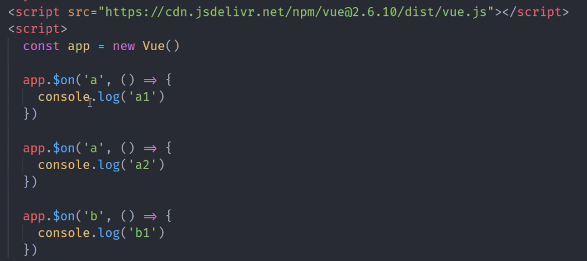

## 问题导入

vue中的事件订阅与发布




当运行 app.$emit('a'), app.$emit('b')时会执行相应的函数。

上面的代码是如何实现的？ 下面我们来写代码自已实现一下。


##  观察者模式

稍微回顾一下观察者模式：

> 观察者模式定义了一种一对多的依赖关系，让多个观察者对象同时监听某一个目标对象，当这个目标对象的状态发生变化时，会通知所有观察者对象，使它们能够自动更新

再详细分析一下我们面临的具体问题。以data.salary为例：
当 data.salary的值变化时，要跟着一起变化的内容有：

- <input v-model="" />中的值
- <span v-bind="salary"></span>中的值。
- {{salary}} 中的值
- 计算属性 的值
.....

现在，这个问题是不是非常适合使用观察者模式？ 真的是再适合不过了。观察者模型有两个重要的概率：目标对象， 观察者。在我们现在面临的问题中，目标对象就是`data.salary`，观察者有多个，可以把它们放在一个列表中： [更新input，更新span,更新{{}},.....]

下面，我们来实现一个典型的观察者模式

### 基本款的观察者模式

```
function EventEmitter () {
    // this.subs = [{事件名:[处理函数1，处理数2,...]}]
    this.subs = {}
}
EventEmitter.prototype.addListener = function(eventType, callback) {
    this.subs[eventType] = this.subs[eventType] || []
    this.subs[eventType].push(callback)
}
EventEmitter.prototype.fire = function(eventType) {
    this.subs[eventType] && this.subs[eventType].forEach(callback => {
        callback()
    })
}
```
- 目标对象内部维护了一个list（数组）,并对外暴露了对这个list的增删改查操作（本例中只有add方法）和一个notify(在某个时机对外通知)。 
- 一个观察者就是一个普通的函数，它们之所以称为观察者是因为被加入到目标对象的List中，并且，目标对象可以通过notify来执行这些函数。除此之外，它就是一个函数。

类比理解一下这个场景：你关注一个微信公众号，微信公众号有新消息时，就会通知你。这里：你就是n多个粉丝之一，就是一个观察者。 微信公众号就是目标对象，它的notify方法就是发通知给你。作为拓展，你可以继续给list增加一个del方法，来模拟取消对微信公众号的关注。这里也不展开了。

