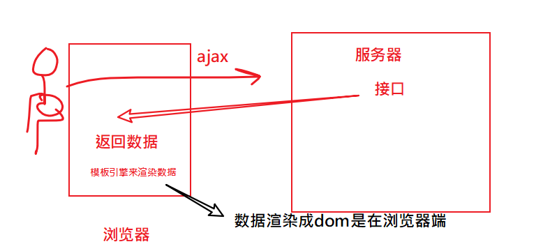
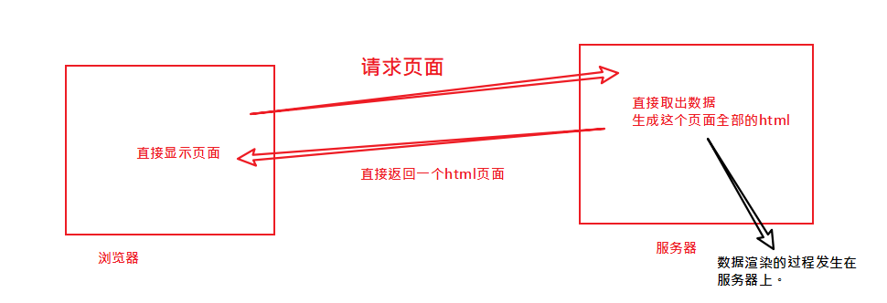
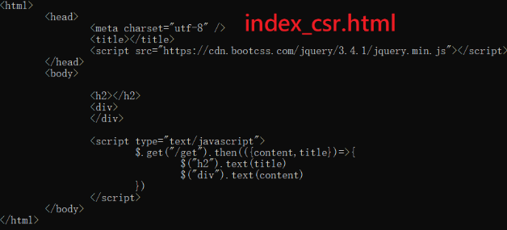
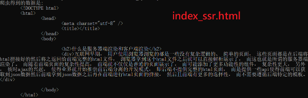

客户端渲染数据

- ajax求数据，回来之后用vuejs来渲染数据。数据渲染（从json--->dom）是发生在浏览器端




服务端渲染数据




## 一个页面有两种生成方式给浏览器

服务器渲染（数据到dom的过程是发生在服务器端）

- Server Side Render (服务端渲染 SSR)。
- 客户端浏览器在地址栏中输入网页的地址，取回来的就是html页面。

客户器渲染（数据到dom的过程是发生在客户端）

- Client Side Render (客户端渲染 CSR)
- 客户端浏览器在地址栏中输入网页的地址，取回来的只是html骨架，
- 再去发ajax请求，取回来数据，再显示到页面上(用vue,arttemplate,模板字符串)

[示例代码](https://github.com/fanyoufu/code/tree/master/ssr)

|            | 优点                                                       | 缺点                                                         |
| ---------- | ---------------------------------------------------------- | ------------------------------------------------------------ |
| 客户器渲染 | 适合前后端分离开发，方便维护，单页应用中几乎都是客户端渲染 | 首次加载慢，不利于 SEO                                       |
| 服务器渲染 | 响应速度快，有利于 SEO                                     | 前后端代码混合在一起，难以开发和维护，不适合进行前后端分离开发 |


## 服务器渲染对SEO不友好

### 什么是SEO

Search Engine Optimization 。搜索引擎优化。

百度服务器会使用一些程序来获取网页的内容，分析内容，以提取出关键字，便 于在搜索时能找到网页。 这个过程一般称为爬虫。

> 让百度更容易的去找到你的网页，知道你的网页上有什么内容，这样，其它用户的百度中搜索关键字就可以找到你。

搜索引擎优化的目标是更明确地告诉百度，你的网页上的内容，以便更好地被收录。

### 爬虫代码

我们平常上网都是在浏览器中请求网页地址，爬虫代码是通过代码的方式去请求网页地址。

```javascript
const http = require("http")

let url = "http://localhost:8080/index_csr.html"
// let url = "http://localhost:8080/index_ssr.html"
http.get(url, (res) => {
  let result = ""
  res.setEncoding('utf8');
  res.on('data', (chunk) => {
	  result += chunk
  });
  res.on('end', () => {
    console.log(`爬虫得到的数据是: ${result}`);
  });
});
```


百度是用爬虫来访问你的网页，所以，你如果想让百度收录的你的网页，则你应该让它的爬虫软件获取网页的内容。

- 如果你的网页是客户端器渲染，则它获取的内容就是空架子。

  

- 如果你的网页是服务器渲染的，则它获取的内容就是真正的html页面内容




[示例代码](https://github.com/fanyoufu/code/tree/master/ssr)

## vue中的服务端和客户端渲染

我们使用vue开发的的项目都是典型的SPA（单页面应用程序），并是标准的前后端分离的，很显然是属于客户端渲染的范畴。

* 好处：页面导航不用刷新整个页面，体验好，有利于前后端分离开发
* 缺点：不利于 SEO（因为单页面应用中都是使用客户端渲染的方式），还有首次响应慢（第1次要加载大量的公共资源）

是否有相对折中的解决方案，或者是两全其美的解决方案呢？


## Vue的SSR介绍及示例演示

> Vue的SSR(服务端渲染)是什么?

Vue.js 是构建客户端应用程序的框架。默认情况下，可以在浏览器中输出 Vue 组件，进行生成 DOM 和操作 DOM。然而，也可以将同一个组件渲染为**`服务器端的 HTML 字符串`**，将它们直接发送到浏览器，最后将这些静态标记"激活"为客户端上完全可交互的应用程序。

[Vue的SSR文档](https://ssr.vuejs.org/zh/) 

### 创建项目

创建一个空目录，进入，并运行：

```javascript
npm init --yes
```


### 安装依赖

[参考](https://ssr.vuejs.org/zh/guide/#%E5%AE%89%E8%A3%85)

```bas
npm install vue vue-server-renderer --save
```

### 示例：在node中通过vue渲染数据

新建文件为01.js，内容如下：

```javascript
const Vue = require('vue')
const app = new Vue({
  template: `<div>{{title}}</div>`,
  data:{
	  title:"hello,vue ssr!"
  }
})

// 第 2 步：创建一个 renderer
const renderer = require('vue-server-renderer').createRenderer()

// 第 3 步：将 Vue 实例渲染为 HTML
// 方法一：回调函数
renderer.renderToString(app, (err, html) => {
  if (err) throw err
  console.log(html)
  // => <div data-server-rendered="true">Hello World</div>
})

// 方法二：promise
// 在 2.5.0+，如果没有传入回调函数，则会返回 Promise：
renderer.renderToString(app).then(html => {
  console.log(html)
}).catch(err => {
  console.error(err)
})
```

运行结果：

```bash
node 01.js
```

输出结果如下：

```javascript
<div data-server-rendered="true">hello,vue ssr!</div>
<div data-server-rendered="true">hello,vue ssr!</div>
```


### 示例:与服务器功能集成

目标：

请求网页`http://localhost:3000/index.html`，在服务器端使用vue-server-renderer来渲染生成html文档，并返回

涉及npm包：

- express
- vue， vue-server-renderer

代码如下：

```javascript
const express = require('express');

const app = express()

const Vue = require('vue')

const renderer = require('vue-server-renderer').createRenderer()

app.get("/index.html",(req,res)=>{
	
	let template= `
	<ul>
		<li v-for="(item,idx) in list" :key="idx">
			<h3>{{item.author}}</h3>
			<div>{{item.content}}</div>
		</li>
	</ul>
	`
	const data = {
		list:[{author:"李白",content:"举杯邀明月"},
		{author:"杜甫",content:"喝酒不开车"},
		{author:"杜甫",content:"喝酒不开车"}]
	}
	const vm = new Vue({
	  template,
	  data
	})

	renderer.renderToString(vm, (err, html) => {
	  if (err) throw err
	  res.send(html)
	})
})

app.listen(3000,()=>{
	console.log('3000');
})

```


