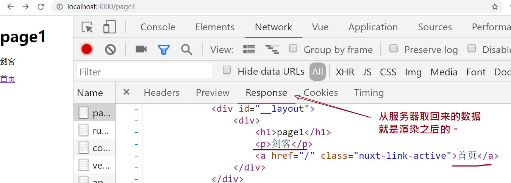
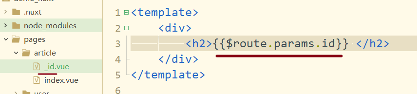
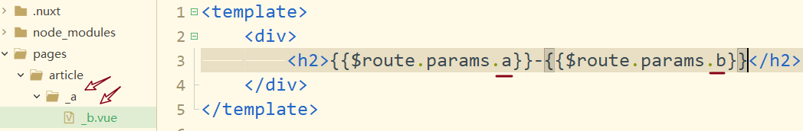
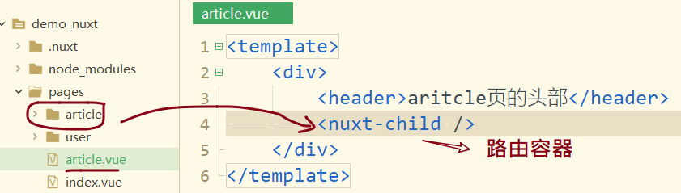
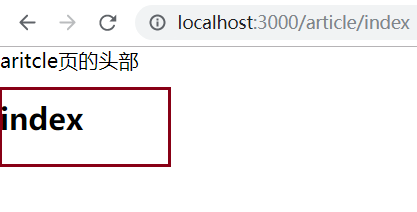
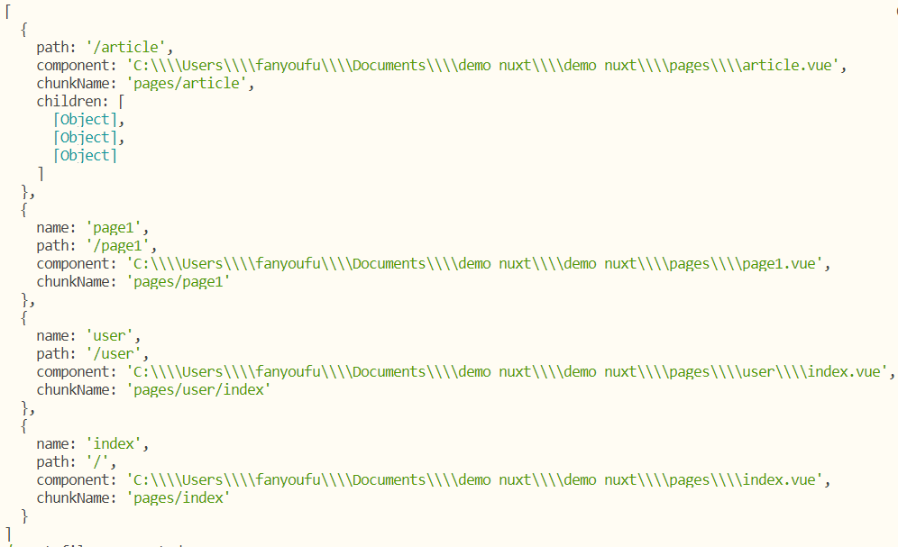
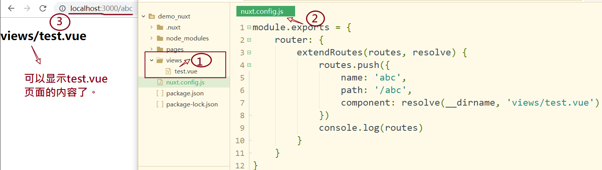
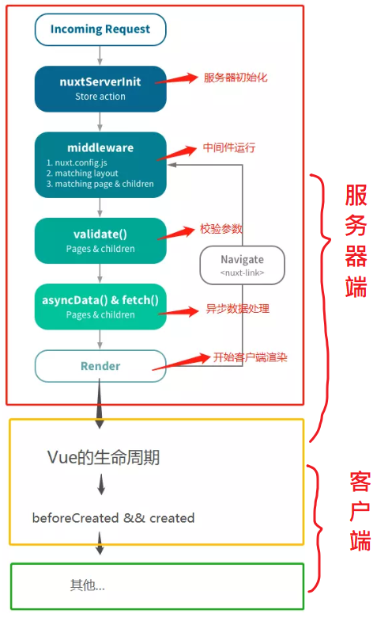

多年以前，web 只是一些由 HTML 和 CSS 搭建的静态页面，没有太多的交互。用户的每一个动作都需要服务器来创建并返回一个完整的页面。幸而有了 JavaScript，开发者开始创建很棒的效果，不过 Ajax 的到来才是这场革新的真正开始。Web 开发者开始编写能够与服务端进行交互，且在不重载页面的情况下向服务端发送并接受数据的页面。

随着时间的推移，客户端代码可以做的事情越来越多，催生了被称作单页面应用（SPA）的一类应用。SPA 在首次加载页面时就获取了所有必需的资源，或者再按需动态加载并且渲染到页面上。 [Gmail](https://link.zhihu.com/?target=https%3A//mail.google.com/) 和 [StackEdit editor](https://link.zhihu.com/?target=https%3A//stackedit.io/editor) 是很棒的 SPA 示例。

SPA 准许重度的交互设计，因为几乎所有的操作都在客户端执行，保持最低限度地与服务端进行交流。不幸的是，它们也存在一些严重的问题，我们选择几个进行讨论。

- 性能

因为相对于静态页面，SPA 需要更多的客户端代码，需要下载数据的体积也更大。这使得手机加载速度很慢，可能会导致一些极端的状况 —— 比如糟糕的用户体验以及收入上的损失等。依据 [Microsoft](https://link.zhihu.com/?target=http%3A//blogs.msdn.com/b/ie/archive/2014/10/08/http-2-the-long-awaited-sequel.aspx) 的一篇文章 ——

> Bing 的一项研究表明：页面的加载时间每增加 10ms，站点年度总收入就会减少 $250K。

- SEO

因为单页面应用依赖于 JavaScript 的执行，服务器不会提供它们可能用到的任何 HTML 内容。因此，web 爬虫很难去索引到这些页面。爬虫就是可以向 web 服务器发送请求，并且将结果分析成原始文本的程序，而不需要像一个浏览器运行 JavaScript 那样解释和执行客户端的内容。不久前，[Google 优化了搜索引擎的 web 爬虫](https://link.zhihu.com/?target=http%3A//googlewebmastercentral.blogspot.co.uk/2014/05/understanding-web-pages-better.html)，现在它也可以抓取基于客户端 JavaScript 所构建的页面了。但是 Bing、Yahoo 以及其他搜索引擎怎么办？一个好的索引对任何公司来说都至关重要，它通常会带来更多的流量以及更高的回报。


## [Nuxt](https://nuxtjs.org/)


基于 Vue、Webpack 和 Babel Nuxt.js 集成了以下组件/框架，用于开发完整而强大的 Web 应用：

1. [Vue 2](https://github.com/vuejs/vue)
2. [Vue-Router](https://github.com/vuejs/vue-router)
3. [Vuex](https://github.com/vuejs/vuex) (当配置了 [Vuex 状态树配置项](https://zh.nuxtjs.org/guide/vuex-store) 时才会引入)
4. [Vue 服务器端渲染](https://ssr.vuejs.org/en/) (排除使用 [`mode: 'spa'`](https://zh.nuxtjs.org/api/configuration-mode))
5. [Vue-Meta](https://github.com/nuxt/vue-meta)

注意：

1. Nuxt**`不是`**Vue官方提供的
2. Nuxt是**`基于Vue`**的服务端渲染的框架
3. Nuxt.js 预设了利用 Vue.js 开发**`服务端渲染`**的应用所需要的各种配置。


## 从头开始创建项目

创建一个demo_nuxt的空文件夹

### 初始化

```javascript
npm init --yes
```

就会生成package.json文件。

### 安装包

```bash
npm i nuxt
```

### 创建第一个页面

在项目根目录下创建pages文件夹（pages是固定名字），并在下面新建一个普通的index.vue文件。

/pages/index.vue

```javascript
<template>
	<div>
		<h1>{{title}}</h1>
	</div>
</template>

<script>
	export default {
		data(){
			return {
				title:"hello nuxt"
			}
		}
	}
</script>

<style>
</style>

```

注意：

​	pages文件夹是固定写法，必须要是这个名字


### 运行项目

两个步骤：

1.  package.json中添加server命令
2. 通过npm run serve来运行。

具体如下:

1. 在package.json中添加一个命令：

```diff
{
  "name": "demo_nuxt",
  "version": "1.0.0",
  "description": "",
  "main": "index.js",
  "scripts": {
+	"serve": "nuxt",
    "test": "echo \"Error: no test specified\" && exit 1"
  },
  "keywords": [],
  "author": "",
  "license": "ISC",
  "dependencies": {
    "nuxt": "^2.11.0"
  }
}

```

2. 在项目根目录下运行`npm run server`

> 注意：
>
> 1. serve这个名字是可以自行修改了，只要保存在package.json中的scripts下的名字与npm run 后的名字保持一致就可以了。
>
> 2. npm run serve 的含义是去运行node_modules下nuxt包中的代码。


如果没有什么错误，你应该可以在localhost:3000中看到代码运行的效果了。

### 创建第二个页面

在pages文件夹，新建一个普通的page1.vue文件。

/pages/page1.vue

```javascript
<template>
	<div>
		<h1>page1</h1>
		<p>{{title}}</p>
		<nuxt-link to="/">首页</nuxt-link>
	</div>
</template>

<script>
	export default {
		data() {
			return {
				title:"剑客"
			}
		}
	}
</script>
```

注意：

 - next-link 用来进行页面跳转。
 - 在地址栏中输入http://localhost:3000/page1来访问这个页面

### 小结

现在项目中只有一个包nuxt，而其它的vue,vue-router,webpack等都集成了。

## 理解单页应用和服务端渲染

### 服务端渲染

上面的例子中，http://localhost:3000/page1 得到的内容是





### 单页应用

在从地址：http://localhost:3000/page1  转到  http://localhost:3000/ 时，页面并不刷新。


## [路由](https://zh.nuxtjs.org/guide/routing)

### 自动配置路由

nuxt.js会默认会把 **pages** 中的页面，自动生成路由配置信息。

假设 `pages` 的目录结构如下：

```
|-pages/
|-----| user/
|-----| ----index.vue
|-----| page1.vue
|-----| index.vue
```

那么，Nuxt.js 自动生成的路由配置如下：

```
router: {
  routes: [
    {
      name: 'index',
      path: '/',
      component: 'pages/index.vue'
    },
    {
      name: 'user',
      path: '/user',
      component: 'pages/user/index.vue'
    },
    {
      name: 'page1',
      path: '/page1',
      component: 'pages/page1.vue'
    }
  ]
}
```

### 路由跳转

```html
<nuxt-link to="/">首页</nuxt-link>
```

- 类比理解：vue-router中是：`router-link`。在nuxt中是nuxt-link。
- 不要直接使用a。 `<a href='/page'>跳转</a>`。


>  它还是单页应用。

### 动态路由

在 Nuxt.js 里面定义带参数的动态路由，需要创建对应的**以下划线作为前缀**的 Vue 文件 或 目录。

#### 单个参数

目标：访问http://localhost:3000/article/10 时，把10传给页面

目录结构如下:



对应生成的路由如下：

```javascript
router: {
  routes: [
    {
      name: 'article',
      path: '/article',
      component: 'pages/article/index.vue'
    },
    {
      name: 'article-id',
      path: '/article/:id?',
      component: 'pages/article/_id.vue'
    } 
  ]
}
```


#### 多个参数

目标：访问http://localhost:3000/article/100/ok 时，把10和ok都传给页面

目录结构如下：



### 嵌套路由

创建内嵌子路由需要两步：

1. 创建一个 Vue 文件
   - 在这个文件内部使用`<nuxt-child />` 用于显示子视图内容

2. 在同级目录下创建与该*文件同名*的目录用来存放子视图组件。


示例文件结构如下：



访问效果如下：

http://localhost:3000/article/index。在把article/index中的内容以子路由的形式显示在article.vue内部。



### 手动配置路由

nuxt把路由设置全放在一个配置文件中。


#### 步骤

1. 在项目根目录下创建名为`nuxt.config.js`的文件。
2. 按[文档](https://zh.nuxtjs.org/api/configuration-router#extendroutes)中指定格式来配置路由


#### 示例

- 创建 `nuxt.config.js`

  内容如下：

  ```js
  module.exports = {
    router: {
      // routes 默认的路由表
      // resolve 一个函数，用来配置路由组件的路径
      extendRoutes (routes, resolve) {
        console.log(routes)
      }
    }
  }
  ```


重启服务，在控制台会输出现有路由配置情况：



#### 下面来补充一个路由

目标：通过http://localhost:3000/abc来访问views目录下的test.vue。

步骤：

1. 在pages的同级目录下新建一个views目录，并在下面创建一个名为abc.vue的文件,写入部分内容。

2. 自定义路由如下：

```javascript
module.exports = {
  router: {
    // routes 默认的路由表
    // resolve 一个函数，用来配置路由组件的路径
    extendRoutes (routes, resolve) {
      routes.push({
        name: 'abc',
        path: '/abc',
        component: resolve(__dirname, 'views/test.vue')
      })
      console.log(routes)
    }
  }
}
```

>  注意：修改了nuxt.config.js需要重新启动服务。

效果：



## 服务器渲染的能力

在我们前面学习的vue项目中，都是在客户端渲染：

- 页面（不带数据的）取回来
- 再发ajax去求接口，再渲染数据


服务器端渲染是：

- 请求页面，
- 服务器收到这个接求，去请求数据，生成页面（带数据的）
- 返回给客户端（有数据的）


讨论发ajax取数据的过程。

### 回顾客户端渲染的情况

共两步：

1. 安装axios包，用来请求接口数据。

2. 在page1.vue中改写代码如下。

   就是一个最简单的ajax请求，并用v-for渲染数据的例子。

```html
<template>
	<div>
		<h1>page1</h1>
		<p>{{title}}</p>
		<ul>
			<li v-for="(item,idx) in list" :key="idx" >
				{{item.author}}
			</li>
		</ul>
		<nuxt-link to="/">首页</nuxt-link>
	</div>
</template>

<script>
	import axios from "axios"
	export default {
		data() {
			return {
				title:"剑客",
				list:[],
			}
		},
		created() {
			axios( {method:"get", url:'http://www.liulongbin.top:3006/api/getbooks'}).then(res=>{
				this.list = res.data.data
				console.log(res.data.data);
			})
		}
	}
</script>
```

​	3. 运行代码。并在浏览器中观察数据的请求来源。

> 其它测试用的接口也可以使用这里的。
>
> https://github.com/typicode/jsonplaceholder

### 学习服务器端渲染asyncData 

#### 基本使用

- asyncData是Nuxt中额外增加的 vue 生命周期的钩子函数。在这个钩子函数中，代码是在服务端执行。

- 没有 Vue 实例的 this，this 指向 undefined

- 获取到的数据，以对象格式返回，并最终会附加到vue组件的data数据项中。

  ```javascript
  <template>
  	<div>
  		<h1>page1</h1>
  		<ul>
  			<li v-for="(item,idx) in serList" :key="idx" >
  				{{item.title}}
  			</li>
  		</ul>
  	</div>
  </template>
  <script>
  import axios from "axios"
  export default {
      data() {
          return {
              title:"剑客"
          }
      },
      asyncData(){
          console.log("asyncData, 是在服务器端中执行");
          return {serList: [{title:"服务器数据1"},{title:"服务器数据2"}] }
      },
      created() {
          console.log("created")
      }
  }
  </script>
  ```

  上例是获取同步数据。


#### 获取接口数据

思路：

在asyncData在这个钩子函数（生命周期）中，去发axios请求，以对象的格式返回数据；

它就会自动附加在vue组件的data上。

```js
<template>
	<div>
		<h1>page1</h1>
		<p>{{title}}</p>
		<ul>
			<li v-for="(item,idx) in list" :key="idx" >
				{{item.author}}
			</li>
		</ul>
		<nuxt-link to="/">首页</nuxt-link>
		
		<ul>
			<li v-for="(item,idx) in newList" :key="idx" >
				{{item.title}}
			</li>
		</ul>
	</div>
</template>

<script>
	import axios from "axios"
	export default {
		data() {
			return {
				title:"剑客",
				list:[],
				
			}
		},
		async asyncData(){
			let res = await  axios( {method:"get", url:'http://www.liulongbin.top:3006/api/news'})
			console.log( res.data.data )
			return {newList: res.data.data}
		} ,
		created() {
			axios( {method:"get", url:'http://www.liulongbin.top:3006/api/getbooks'}).then(res=>{
				this.list = res.data.data
				console.log(res.data.data);
			})
		}
	}
</script>
```


#### 同构

在asyncData()中的写的代码会在服务器端执行，也会在客户端执行。

假设在pages/index.vue这个页面中使用asyncData钩子函数，在这个函数中去请求接口，获取数据，并交给vue来渲染。

- 用户第一次请求这个http://localhost:3000/index页面，asyncData()中的代码会在服务器端执行，获取完成数据后，渲染好html再返回。
- 用户在页面上进行路由跳转:
  - 从http://localhost:3000/index跳到http://localhost:3000/otherpage。
  - 再从http://localhost:3000/otherpage回到http://localhost:3000/index页,此时
    - asyncData()中的代码会在客户端执行。

### 同构 web app

同构应用：单页应用 + 服务端渲染


同构 JavaScript 应用基于 JavaScript 编写，可以在客户端和服务端运行。正因为此，你只需要写一次代码，就可以在服务端渲染静态页面，还可以在客户端完成复杂的交互。所以，这种方式互通了两个世界，并且避免了前面提到了两个问题。


## 生命周期

- 在服务器端要执行：
  - asyncData
  - **beforeCreate(在服务器和客户端都会执行)**
  - **created(在服务器和客户端都会执行)**
- 在客户端要执行
  - asyncData(在路由切换时，它也会执行)
  - **beforeCreate(在服务器和客户端都会执行)**
  - **created(在服务器和客户端都会执行)**
  - mounted
  - .....




```javascript
beforeCreate
created
beforeMount
mounted

```


在服务器端执行：

- asyncData
- beforeCreate
- created

在客户器端执行：

- asyncData 只在路由切换时
- beforeCreate
- created
- beforeMount
- mounted
- beforeUpdate
- updated
- ......

发请求操作：

- 如果 需要SEO，写在asyncData中
- 如果不需要SEO，则可以写到mounted中，
  - 不要写在created中，因为它会在服务器端和客户端渲染时都执行，如果这里写调用接口取数据，则会请求两次。


