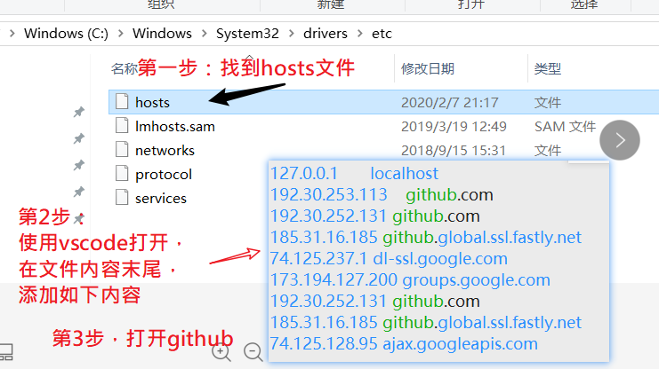
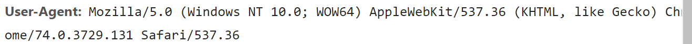
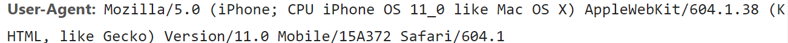
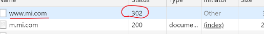
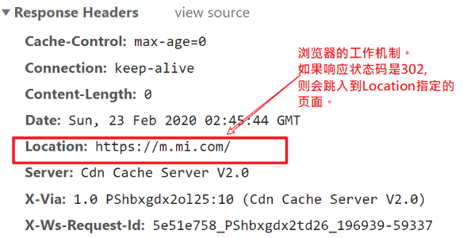

## github无法访问的一种解决方案



```bash
127.0.0.1       localhost
192.30.253.113    github.com
192.30.252.131 github.com
185.31.16.185 github.global.ssl.fastly.net
74.125.237.1 dl-ssl.google.com
173.194.127.200 groups.google.com
192.30.252.131 github.com
185.31.16.185 github.global.ssl.fastly.net
74.125.128.95 ajax.googleapis.com
```

## app分类

app就是运行在移动设备上的程序；

按开发方式分类：

- 原生开发
- web开发（网页）
- 混合开发


## 原生开发

根据手机的不同操作系统，使用各自不同的编程语言来写程序。

- 安卓
- ios

优点：性能好，各种好。

缺点：

- 费钱
- 用户升级...
- 平台上审核...


## 访问网页时，服务器是如何知道当前用户是pc还是手机？

从客户端浏览器向服务器发请求时，会自动携带请求头，后端是可以收到这个请求头的。

其中有一个头叫：`User-agent`(用户代理)。它保存的字符串就可以用来识别当前的浏览器的信息。

下面这个是pc的。



下面这个是移动端的



服务器收到不同的头，会分析，决定是否要跳转到pc，或者是移动端。

如果要跳转，就给302状态码，并设置location响应头，则浏览器会自动跳转。





## webApp

就是一个移动端的网站。

优点：

- 经济，省钱。就是做网页。
- 升级更新方便

缺点：

- 功能受限（不能使用原生的api：打电话，监控电池，拍照...）
- 没有固定入口。
  - 通过挂在微信公众号的链接中，可以定下来入口。


## HybridApp 混合模式

在html5页面的之外，包一个原生的壳webView。

好处：

- 因为有原生的壳，就可以去调用原生的api(拍照....)
- 代码是h5的，所以成本比较低

缺点：

- 体现还是不如原生的好。

后面会通过hbuilderx 软件来给大家演示。


## 三种跨平台的开发方式

跨平台：我只写一次代码，就可以生成ios，安卓的app。

技术：

- RN:react native
- weex
- flutter


## 其它开发方式

- 小程序
- 快应用
- 直达号

## 多端开发

目标:写一次代码，运行在不同的**端**（微信小程序，百度小程序，头条小程序.....）

代表：

- taro: JD. 基于react。 
- uni-app: ucloud,基于vue